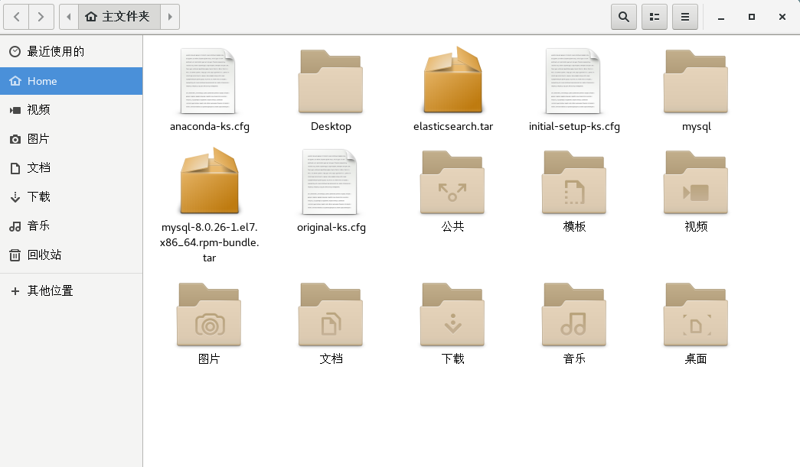
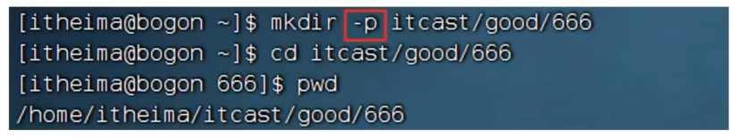

# Linux

## Linux概述

Linux是作为服务器当中比较广泛的系统，他同样有Windows与macOS一样的图形面板和命令行面板，但与之不同的是，windows与macOS是图形面板比较好用，Linux与之相反，它的图形面板相对来说不是很成熟，命令行面板与其相比更加好用。

Linux可以作为服务器的系统，原因是他更多的是使用命令进行操作系统，故而可以使用第三方软件去连接到服务器去做相应的一些操作，Windows与macOS的命令行不是那么好用，所以国内很多公司都会选择Linux去作为服务器的系统。

## Linux目录结构

1. **Linux的目录结构**

   * Windows系统可以拥有多个盘符，如C盘、D盘、E盘

     

   * Linux的目录结构是一个树形结构，它没有盘符这个概念，只有一个根目录 `/` ，所有文件都在它下面

     

2. **Linux的路径描述方式**

   * 在Linux系统中，路径之间的层级关系，使用：`/` 来表示

     

   * 在Windows系统中，路径之间的层级关系，使用： `\` 来表示

     

## Linux命令入门

### 1. Linux命令基础

1. **什么是命令、命令行**

   学习Linux，本质上实在学习在命令下熟练使用Linux的各类命令。

   * 命令行：即Linux终端（Terminal），是一种命令提示符页面。已纯“字符”的形式操作系统，可以使用各种字符化命令对系统发出操作指令。

   * 命令：即Linux程序。一个命令就是Linux的程序。命令没有图形化页面，可以在命令行（终端中）提供字符画的反馈。

     

2. **Linux命令基础格式**

   无论是什么命令，用于什么用途，在Linux中，命令有其通用的格式： `command [-options] [parameter]`

   * command：命令本身
   * -options：[可选，非必填]命令的一些参数选项，可以通过选项控制命令的行为细节
   * parameter：[可选，非必填]命令的参数，多数用于命令的只想目标等

   ***语法中的[]，表示可选的意思***

   示例：

   * ls -l /home/itheima, ls是命令本身，-l 是选项，/home/itheima是参数

     **意思是以列表的形式，显示/home/itheima目录内的内容**

   * cp -r test1 test2，cp是命令本身，-r是选项，test1和test2是参数

     **意思是复制文件夹test1成为test2**

### 2. ls命令入门

1. **ls命令**

   ls命令的作用是列出目录下的内容，语法细节如下：

   `ls [-a -l -h] [Linux路径]`

   * -a -l -h是**可选**的选项
   * Linux路径是此命令可选参数

   当不使用选项和参数，直接使用ls命令本体，表示：以平埔形式，列出当前工作目录下的内容

   

2. **HOME目录和工作目录**

   直接输入ls命令，表示列出当前工作目录下的内容

   * 当前用户的HOME目录作为当前目录，所以ls命令列出的是HOME目录的内容

   * HOME目录：每个Linux操作用户在Linux系统的个人账户目录，路径在：/home/用户名

     * 如，图中的Linux用户是itheima，其HOME目录是/home/itheima

     * Windows系统和Linux系统，均设有用户的HOME目录，如图

       * Windows系统

         

       * Linux系统

         

### 3. ls命令的参数和选项

**ls命令的参数**

刚刚展示了，直接使用ls命令，并未使用选项和参数。

`ls [-a -l -h] [Linux路径]`

那么ls的选项和参数具体有什么作用呢？首先我们先来看参数。

* 当ls不使用参数，表示列出：当前工作目录的内容，即用户的HOME目录
* 当使用参数，ls命令的参数表示：指定一个Linux路径，列出指定路径的内容

如：

通过 `ls /` 列出了根目录的内容

## 目录切换相关命令（cd/pwd）

### 1. 掌握cd切换工作目录命令

当Linux终端（命令行）打开的时候，会默认以用户的HOME目录作为当前的工作目录

我们可以通过cd命令，更改当前所在的工作目录

cd命令来自英文：Change Directory

语法： `cd [Linux路径]` 

* cd命令无需选项，只有参数，表示要切换到那个目录下

* cd命令直接执行，不写参数，表示回到用户的HOME目录

  

### 2. pwd查看当前工作目录

通过ls来验证当前的工作目录，其实是不恰当的。

我们可以通过pwd命令，来查看当前所在的工作目录。

pwd命令来自：Print Work Directory

语法： `pwd` 

* pwd命令，无选项，无参数，直接输入pwd即可

## 创建目录命令(mkdir)

### 掌握通过mkdir命令创建目录（文件夹）

1. **mkdir命令**

   通过mkdir命令可以创建新的目录（文件夹）

   mkdir来自英文：Make Directory

   语法： `mkdir [-p] Linux路径` 

   * 参数必填，表示Linux路径，既要创建的文件夹的路径，相对路径或绝对路径均可
   * -p选项可选，表示自动创建不存在的父目录，数用于创建连续多层级的目录

   

2. **mkdir -p 选项**

   如果想要一次性创建多层级的目录，如下图：

   

   会报错，因为上级目录itcast和good并不存在，所以无法创建666目录可以通过-p选项，将一整个链条都创建完成

   

    ***注意：创建文件夹需要修改权限，请确保操作均在HOME目录内，不要在HOME外操作*** 

    ***涉及到权限问题，HOME外无法成功*** 

    ***后续我们会讲解权限管控的知识*** 

## 文件操作命令partl(touch、cat、more)

1. **touch创建文件** 

   可以通过touch命令创建文件

   语法： `touch Linux路径` 

   * touch命令无选项，参数必填，表示要创建的文件路径，相对、绝对、特殊路径符均可以使用

   

2. **cat命令 查看文件内容** 

   有了文件后，我们可以通过cat命令查看文件的内容。

   不过，现在我们还为学习vi编辑器，无法向文件内编辑内容，所以，暂时，我们先通过图形化，在图形化中，手动向文件内添加内容，以测试cat命令

   

   

   准备好文件内容后，可以通过cat查看内容。

   语法： `cat Linux路径` 

   * cat同样没有选项，只有必填参数，参数表示：被查看的文件路径，相对、绝对、特殊路径符都可以使用

   

3. **more命令查看文件内容** 

   more命令同样可以查看文件内容，同cat不同的是：

   * cat是直接将内容全部显示出来
   * more支持翻页，如果文件内容过多，可以一页页的展示

   **语法：** `more Linux路径` 

   * 同样没有选项，只有必填参数，参数表示：被查看的文件路径，相对、绝对、特殊路径符都可以使用

   Linux系统内置有一个文件，路径为：/etc/services，可以使用more命令查看

   more /etc/services

   * 在查看的过程中，通过空格翻页
   * 通过q退出查看

   