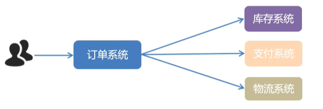
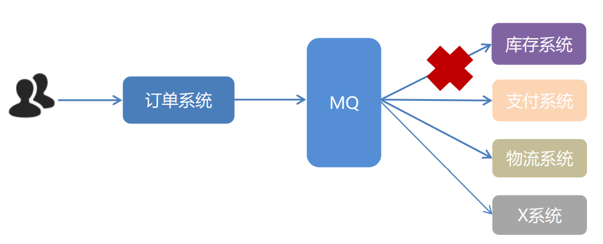
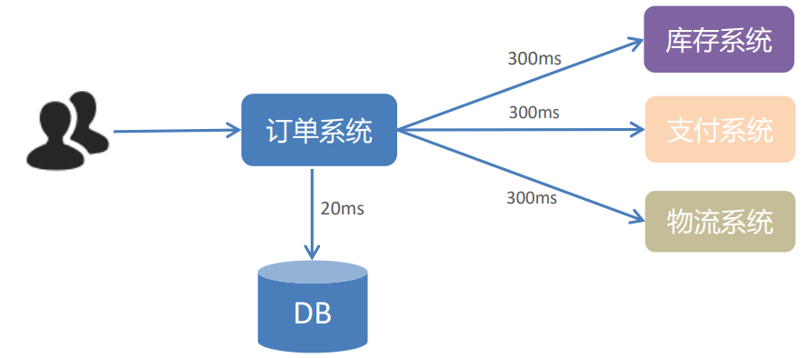
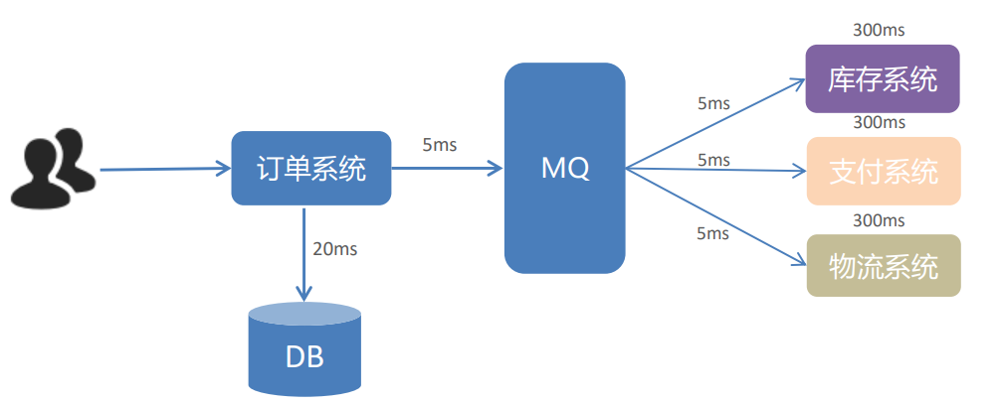
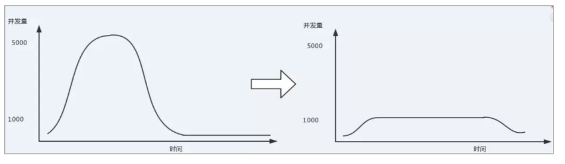

# RabbitMQ

## 1. MQ的基本概念

### 1. MQ概述

   MQ全程Message Queue(消息队列)，实在消息的传输过程中保存消息的容器。多用于分布式系统之间进行通信。

   

   * MQ，消息队列，存储消息的中间件
   * 分布式系统通信两种方式： **直接远程调用** 和 **借助第三方** 完成间接通信
   * 发送方称为生产者，接收方成为消费者

### 2. MQ的优势和劣势

   1. **MQ的优势** 

      1. 应用解耦
         
         * 如图所示，用户会先访问订单系统，再去访问下一层的三个系统，这种情况会让订单系统和剩下的三个系统耦合在一起，当这三个其中有一个报异常了，那么订单系统也就走不通了，相当于整个系统都不能访问了。
         
           如果在此基础上，还需要加入新的服务，那么我们有需要去修改代码，在大量的修改代码的同事，可能也会伴随其他的问题。
         
           
         
           **系统的耦合性越高，容错性就越低，可维护性也就越低** 
         
         * 我们在订单系统和另外三个系统中间插入一个MQ，那么我们就可以进行异步的去访问下面的三个系统，即使某个服务宕机或者报错了，也不会影响其他的服务运行。
         
           
         
           **使用 MQ 使得应用间解耦，提升容错性和可维护性。** 
         
      2. 异步提速
      
         一个下单操作耗时：20 + 300 + 300 + 300 = 920ms 用户点击完下单按钮后，需要等待920ms才能得到下单响应，太慢！
      
         
      
         在中间插上个中间件MQ，那么整个服务的访问速度都会大幅度提升
      
         
      
         用户点击完下单按钮后，只需等待25ms就能得到下单响应 (20 + 5 = 25ms)。
      
         **提升用户体验和系统吞吐量（单位时间内处理请求的数目）。** 
      
      3. 削峰填谷
      
         
      
         使用了 MQ 之后，限制消费消息的速度为1000，这样一来，高峰期产生的数据势必会被积压在 MQ 中，高峰 就被“削”掉了，但是因为消息积压，在高峰期过后的一段时间内，消费消息的速度还是会维持在1000，直 到消费完积压的消息，这就叫做“填谷”。
      
         **使用MQ后，可以提高系统稳定性。** 
      
   2. **MQ的劣势** 

      
      
      * 系统可用性降低
      
        系统引入的外部依赖越多，系统稳定性越差。一旦 MQ 宕机，就会对业务造成影响。如何保证MQ的高可用？
      
      * 系统复杂度提高
      
        MQ 的加入大大增加了系统的复杂度，以前系统间是同步的远程调用，现在是通过 MQ 进行异步调用。如何 保证消息没有被重复消费？怎么处理消息丢失情况？那么保证消息传递的顺序性？
      
      * 一致性问题
      
        A 系统处理完业务，通过 MQ 给B、C、D三个系统发消息数据，如果 B 系统、C 系统处理成功，D 系统处理 失败。如何保证消息数据处理的一致性？
      
      **既然 MQ 有优势也有劣势，那么使用 MQ 需要满足什么条件呢？** 
      
      1. 生产者不需要从消费者处获得反馈。引入消息队列之前的直接调用，其接口的返回值应该为空，这才让明 明下层的动作还没做，上层却当成动作做完了继续往后走，即所谓异步成为了可能。
      2. 容许短暂的不一致性。
      3. 确实是用了有效果。即解耦、提速、削峰这些方面的收益，超过加入MQ，管理MQ这些成本。

### 3. 常见的 MQ 产品

目前业界有很多的 MQ 产品，例如 RabbitMQ、RocketMQ、ActiveMQ、Kafka、ZeroMQ、MetaMq等， 也有直接使用 Redis 充当消息队列的案例，而这些消息队列产品，各有侧重，在实际选型时，需要结合自身需 求及 MQ 产品特征，综合考虑。

**由于 RabbitMQ 综合能力强劲，所以接下来的课程中，我们将主要学习 RabbitMQ。** 

### 4. RabbitMQ 简介

**AMQP** ，即 **Advanced Message Queuing Protocol** （高级消息队列协议），是一个网络协议，是应用层协议 的一个开放标准，为面向消息的中间件设计。基于此协议的客户端与消息中间件可传递消息，并不受客户端/中 间件不同产品，不同的开发语言等条件的限制。2006年，AMQP 规范发布。 **类比HTTP** 。

2007年，Rabbit 技术公司基于 AMQP 标准开发的 RabbitMQ 1.0 发布。RabbitMQ 采用 Erlang 语言开发。 Erlang 语言由 Ericson 设计，专门为开发高并发和分布式系统的一种语言，在电信领域使用广泛。

RabbitMQ 基础架构如下图：

RabbitMQ 中的相关概念：

* **Broker** ：接收和分发消息的应用，RabbitMQ Server就是 Message Broker
* **Virtual host** ：出于多租户和安全因素设计的，把 AMQP 的基本组件划分到一个虚拟的分组中，类似于网 络中的 namespace 概念。当多个不同的用户使用同一个 RabbitMQ server 提供的服务时，可以划分出多 个vhost，每个用户在自己的 vhost 创建 exchange／queue 等
* **Connection** ：publisher／consumer 和 broker 之间的 TCP 连接
* **Channel** ：如果每一次访问 RabbitMQ 都建立一个 Connection，在消息量大的时候建立 TCP Connection 的开销将是巨大的，效率也较低。Channel 是在 connection 内部建立的逻辑连接，如果应用程序支持多线 程，通常每个thread创建单独的 channel 进行通讯，AMQP method 包含了channel id 帮助客户端和 message broker 识别 channel，所以 channel 之间是完全隔离的。Channel 作为轻量级的 Connection  极大减少了操作系统建立 TCP connection 的开销
* **Exchange** ：message 到达 broker 的第一站，根据分发规则，匹配查询表中的 routing key，分发消息到 queue 中去。常用的类型有：direct (point-to-point), topic (publish-subscribe) and fanout (multicast)
* **Queue** ：消息最终被送到这里等待 consumer 取走
* **Binding** ：exchange 和 queue 之间的虚拟连接，binding 中可以包含 routing key。Binding 信息被保存 到 exchange 中的查询表中，用于 message 的分发依据

**RabbitMQ 提供了 6 种工作模式** ：简单模式、work queues、Publish/Subscribe 发布与订阅模式、Routing 路由模式、Topics 主题模式、RPC 远程调用模式（远程调用，不太算 MQ；暂不作介绍）。 官网对应模式介绍：https://www.rabbitmq.com/getstarted.html

### 5.  JMS

* JMS 即 Java 消息服务（JavaMessage Service）应用程序接口，是一个 Java 平台中关于面向消息中间件 的API
* JMS 是 JavaEE 规范中的一种，类比JDBC
* 很多消息中间件都实现了JMS规范，例如：ActiveMQ。RabbitMQ 官方没有提供 JMS 的实现包，但是开 源社区有

## 2. RabbitMQ 的工作模式

### 1. Work queues 工作队列模式

1. **模式说明** 

   * **Work Queues** ：与入门程序的简单模式相比，多了一个或一些消费端，多个消费端共同消费同一个队列中的消息。
   * **应用场景** ：对于任务过重或任务较多情况使用工作队列可以提高任务处理的速度。

2. 代码编写

   **Work Queues** 与入门程序的简单模式的代码几乎是一样的。可以完全复制，并多复制一个消费者进行多 个消费者同时对消费消息的测试。

### 2. Pub/Sub 订阅模式

 **模式说明** 

在订阅模型中，多了一个 Exchange 角色，而且过程略有变化：

* P：生产者，也就是要发送消息的程序，但是不再发送到队列中，而是发给X（交换机）
* C：消费者，消息的接收者，会一直等待消息到来
* Queue：消息队列，接收消息、缓存消息
* Exchange：交换机（X）。一方面，接收生产者发送的消息。另一方面，知道如何处理消息，例如递交给某个特别队列、 递交给所有队列、或是将消息丢弃。到底如何操作，取决于Exchange的类型。Exchange有常见以下3种类型：
  * Fanout：广播，将消息交给所有绑定到交换机的队列
  * Direct：定向，把消息交给符合指定routing key 的队列
  * Topic：通配符，把消息交给符合routing pattern（路由模式） 的队列

**Exchange** （交换机）只负责转发消息，不具备存储消息的能力，因此如果没有任何队列与 Exchange 绑定，或者没有符合 路由规则的队列，那么消息会丢失！

### 3.  Routing 路由模式

**模式说明** 

* 队列与交换机的绑定，不能是任意绑定了，而是要指定一个 RoutingKey（路由key）
* 消息的发送方在向 Exchange 发送消息时，也必须指定消息的 RoutingKey
* Exchange 不再把消息交给每一个绑定的队列，而是根据消息的 Routing Key 进行判断，只有队列的 Routingkey 与消息的 Routing key 完全一致，才会接收到消息

**图解：** 

* P：生产者，向 Exchange 发送消息，发送消息时，会指定一个routing key
* X：Exchange（交换机），接收生产者的消息，然后把消息递交给与 routing key 完全匹配的队列
* C1：消费者，其所在队列指定了需要 routing key 为 error 的消息
* C2：消费者，其所在队列指定了需要 routing key 为 info、error、warning 的消息

### 4. Topics 通配符模式

**模式说明** 

* Topic 类型与 Direct 相比，都是可以根据 RoutingKey 把消息路由到不同的队列。只不过 Topic 类型 Exchange 可以让队列在绑定 Routing key 的时候使用 **通配符** ！

* Routingkey 一般都是有一个或多个单词组成，多个单词之间以”.”分割，例如： item.insert 

* 通配符规则：# 匹配一个或多个词，* 匹配不多不少恰好1个词，例如：item.# 能够匹配 item.insert.abc  或者 item.insert，item.* 只能匹配 item.insert

  

**图解：** 

* 红色 Queue：绑定的是 usa.# ，因此凡是以 usa. 开头的 routing key 都会被匹配到
* 黄色 Queue：绑定的是 #.news ，因此凡是以 .news 结尾的 routing key 都会被匹配